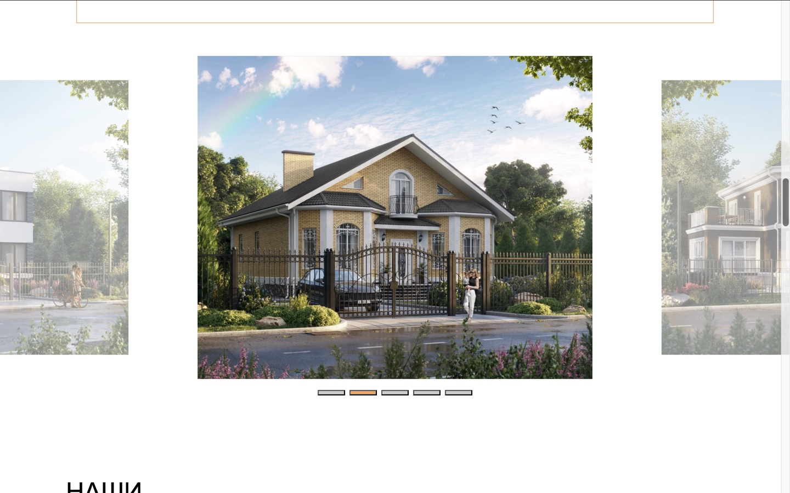
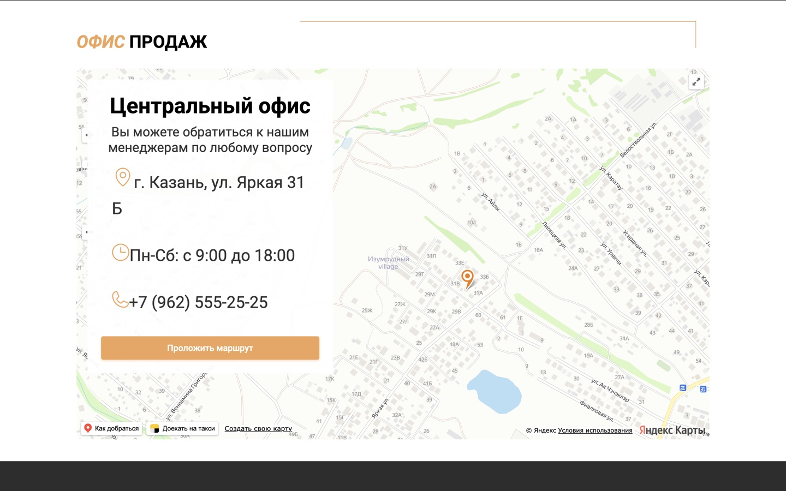

# WinDom

Адаптивный многостраничный сайт строительной компании. Проект разработан для
портфолио и демонстрирует работу с React, TypeScript, маршрутизацией,
интерактивными компонентами и внешним API.

### [Открыть сайт →](https://construction-company-win-dom-kappa.vercel.app/)

## Скриншоты

| Главный экран | Слайдер проектов |
| --- | --- |
|  |  |
| Ипотечные программы | Офис продаж на карте |
|  |  |

## Возможности

- каталог домов с фильтрацией и пагинацией;
- динамические страницы жилых проектов;
- слайдеры проектов, построенных домов и команды;
- интерактивная карта офиса продаж на базе API Яндекс Карт;
- модальные формы с валидацией и управлением с клавиатуры;
- адаптивная вёрстка для мобильных и десктопных устройств;
- прокрутка страницы к началу после перехода по маршруту;
- отдельная страница 404.

Формы работают в демонстрационном режиме: данные валидируются на клиенте, но
не отправляются и не сохраняются.

## Технологии

- React 18;
- TypeScript;
- React Router;
- Webpack 5 и Babel;
- Swiper;
- CSS;
- Node.js Test Runner;
- Vercel.

## Локальный запуск

Требуется Node.js 20 или новее.

```bash
git clone https://github.com/antipozitife/construction-company-WinDom.git
cd construction-company-WinDom
npm ci
npm start
```

Приложение откроется по адресу [http://localhost:3000](http://localhost:3000).

## Настройка Яндекс Карт

Скопируйте `.env.example` в `.env`:

```bash
cp .env.example .env
```

Добавьте JavaScript API-ключ:

```env
WINDOM_YANDEX_MAPS_API_KEY=your_key
```

Файл `.env` не попадает в Git. Без ключа приложение показывает текстовый
fallback с адресом офиса и продолжает работать без ошибок.

Для production ключ хранится в переменной окружения Vercel
`WINDOM_YANDEX_MAPS_API_KEY` и ограничен доменом
`construction-company-win-dom-kappa.vercel.app`.

## Проверка проекта

```bash
npm run check
```

Команда последовательно запускает проверку TypeScript, тесты и
production-сборку. Отдельные команды:

```bash
npm run typecheck
npm test
npm run build
```

## Деплой

Проект автоматически разворачивается на Vercel после push в ветку `main`.
Параметры сборки находятся в `vercel.json`:

- Build Command — `npm run build`;
- Output Directory — `build`;
- SPA rewrite — перенаправление внутренних маршрутов на `index.html`.

После изменения переменных окружения в Vercel необходимо запустить новый
деплой.

## Структура

```text
src/
├── components/   переиспользуемые компоненты
├── data/         типизированные данные проектов
├── hooks/        общая логика и доступные модальные окна
└── pages/        страницы приложения

img/              изображения и SVG-иконки
tests/            автоматические проверки
docs/screenshots/ скриншоты для README
```
